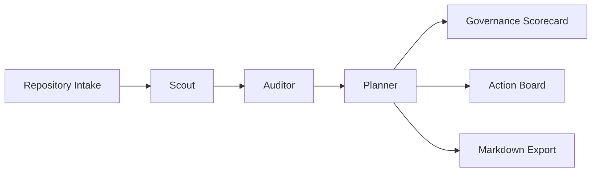

# Repo Sentinel

Repo Sentinel is a public-facing demo of an AI-driven repository governance agent. Instead of acting like a generic chat UI, it turns GitHub-style repository context into a structured governance audit: health score, risk findings, recommended actions, and a Markdown report maintainers can paste into issues or documentation.

## Why this project exists

Recent agentic developer tools have made one pattern especially compelling: agents that plug into software workflows instead of answering isolated prompts. Repo Sentinel borrows that shape for a lightweight, showcase-ready project:

- `Scout` reconstructs repository intent from README, structure, and issue summaries.
- `Auditor` detects governance gaps such as weak testing, thin documentation, and missing automation.
- `Planner` turns those findings into a maintainable action queue with owners and timeframes.

This first version is intentionally demo-safe:

- no GitHub OAuth
- no write access to repositories
- no hidden automation claims
- transparent heuristic analysis that runs locally

## Core experience

1. Paste repository context:
   - `repoName`
   - `readmeText`
   - `structureText`
   - `issueSummary`
2. Run a multi-stage governance audit.
3. Review:
   - `health score`
   - `summary`
   - `risks[]`
   - `actions[]`
   - `reportMarkdown`
4. Copy the Markdown report into GitHub issues, project docs, or hiring portfolio materials.

## Product architecture



## Tech stack

- Next.js 16
- TypeScript
- React 19
- Tailwind CSS 4
- App Router + Route Handlers

## Local development

```bash
npm install
npm run dev
```

Open [http://localhost:3000](http://localhost:3000).

## Validation

```bash
npm run lint
npm run build
```

## Example output shape

```ts
{
  score: 64,
  summary: "Repository audit summary...",
  signals: ["README provides enough intent...", "Testing signals detected..."],
  risks: [
    {
      title: "Weak verification surface",
      detail: "Auditor could not find clear signs of automated testing...",
      level: "high",
      agent: "Auditor"
    }
  ],
  actions: [
    {
      title: "Establish a minimal verification gate",
      rationale: "Add smoke tests and a mandatory lint/build workflow...",
      priority: "high",
      owner: "Platform or core maintainers",
      timeframe: "1-2 days"
    }
  ],
  reportMarkdown: "# Repo Sentinel Governance Report..."
}
```

## Positioning for a portfolio or application

Repo Sentinel is designed to be legible to both engineers and reviewers:

- It demonstrates product thinking, not just UI assembly.
- It frames AI as part of an engineering workflow.
- It shows multi-agent style decomposition without overclaiming autonomous execution.
- It produces concrete outputs that feel useful in real repository operations.

## Suggested next extensions

- Connect to the GitHub API for live repository ingestion.
- Add saved audit sessions and result comparison.
- Generate issue templates directly from recommended actions.
- Support repository-specific policy profiles for frontend, backend, and monorepo projects.
